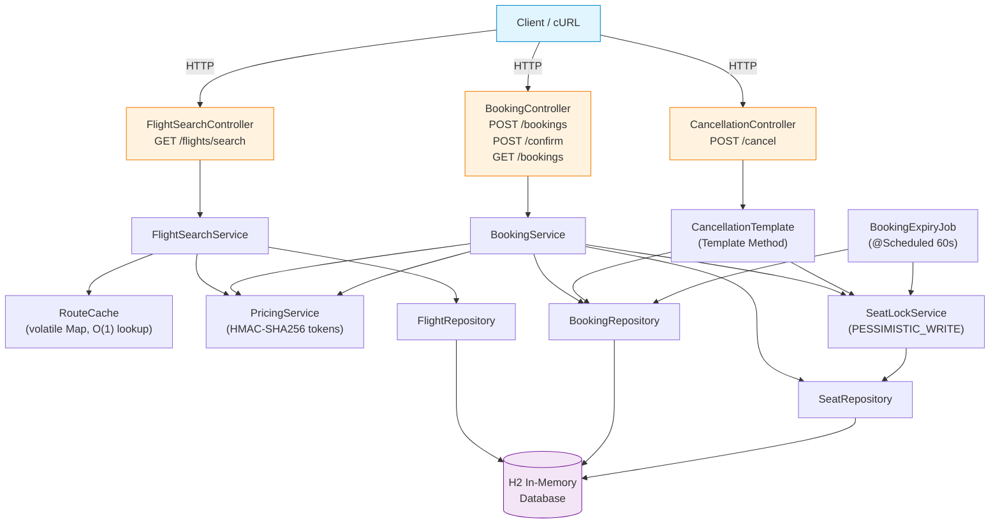
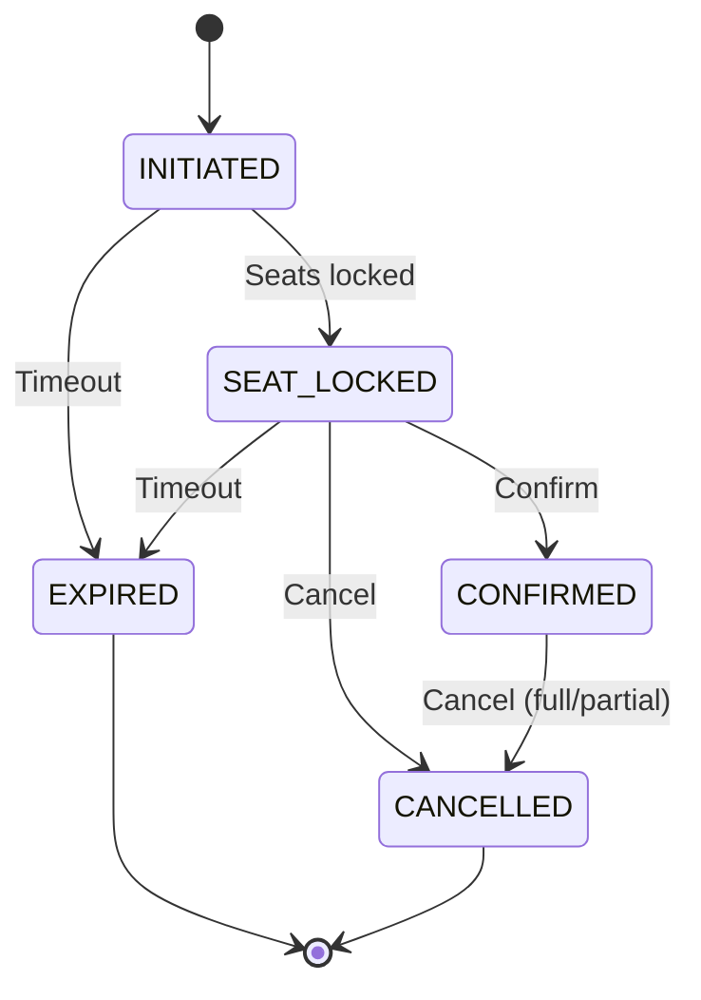
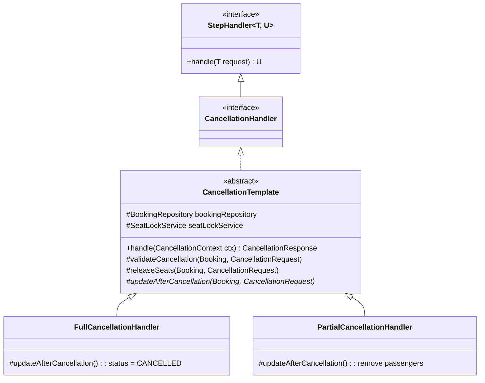
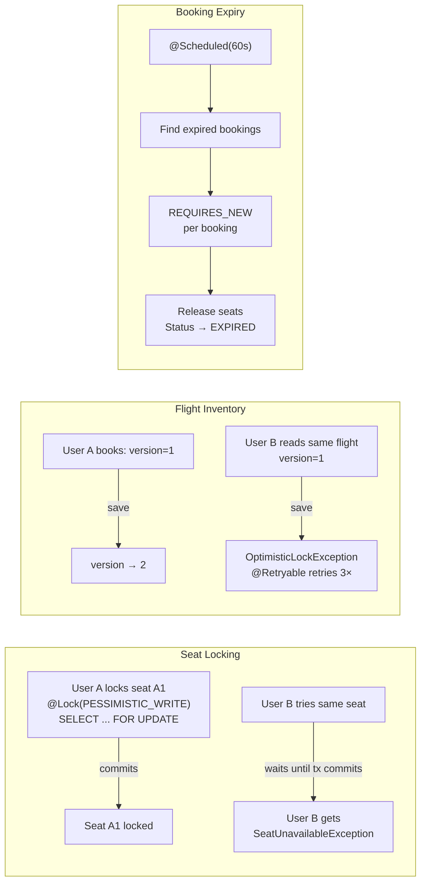
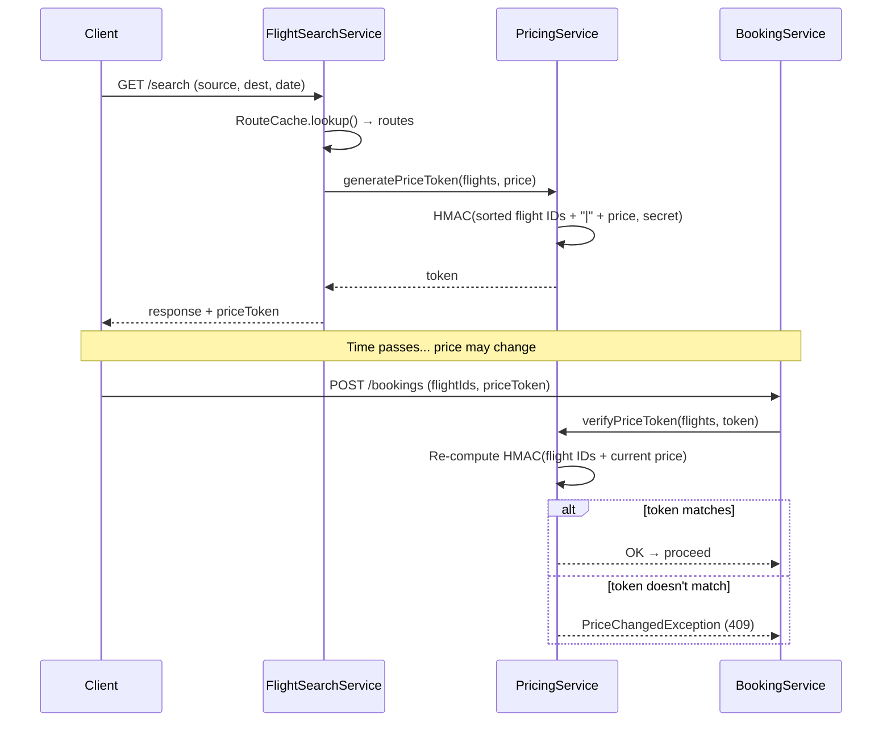

# Flight Booking System

Spring Boot REST API for flight search (direct + multi-stop), booking with seat locking, and cancellations (full + partial). H2 in-memory DB — zero setup.

> **📐 Diagrams below are mermaid — render on [github.com](https://github.com) natively. View locally with VS Code + [Markdown Preview Mermaid Support](https://marketplace.visualstudio.com/items?itemName=bierner.markdown-mermaid) or any mermaid-compatible previewer.**

---

## Problem Statement

### 1. Search Flights
Search by source, destination, date, passenger count. Results include direct/indirect/multi-stop routes. Filter by airline. One-way or round-trip.

### 2. Proceed Booking
Select flight with add-ons (luggage, food, insurance). Price integrity via HMAC tokens. Seat selection with `SELECT FOR UPDATE` lock. Stale booking expiry via scheduled job. *(Payment — UPI, card, net banking, wallet — planned.)*

### 3. Cancel Booking
Cancel by PNR. Full or partial (by passenger). Seats released, inventory restored. *(Refund processing and cancellation policy planned.)*

---

## Scope

| Area | Status |
|------|--------|
| Flight search (direct, 1-stop, multi-stop up to 2 stops) | ✅ |
| Airline filter, one-way/round-trip, layover validation | ✅ |
| Price token (HMAC-SHA256) — prevents mid-session price changes | ✅ |
| Seat selection with `PESSIMISTIC_WRITE` lock + `@Version` on inventory | ✅ |
| Add-ons (luggage, food, insurance), multi-passenger (adult/child/infant) | ✅ |
| Full + partial cancellation, seat release | ✅ |
| Stale booking expiry (`@Scheduled`, `REQUIRES_NEW`) | ✅ |
| 57 tests (13 unit + 28 service + 16 integration), JaCoCo coverage | ✅ |
| Payment integration (UPI, card, net banking, wallet) | ⏳ Planned |
| Refund processing, cancellation policy | ⏳ Planned |

### Out of Scope
Auth, notifications, GDS integration, UI, Docker.

---

## Non-Functional Requirements

| Requirement | Target | Approach |
|-------------|--------|----------|
| Concurrent users | 10K+ | Pessimistic seat locks (`SELECT FOR UPDATE`), pre-computed `RouteCache` |
| Flights/day | 2K+ | `RouteCache` built on `@PostConstruct`, refreshed by `@Scheduled` — no per-request route computation |
| Search latency | <200ms | O(1) cache lookup via `volatile Map<RouteKey, List<RoutePath>>` — zero DB at search time |
| Booking latency | <500ms | `@Transactional` + batched seat locking + `@Retryable` for optimistic lock conflicts |
| Cancellation latency | <500ms | Template Method with single `save()`, batch seat release |
| Consistency | > Availability | `PESSIMISTIC_WRITE` prevents double-booking, `@Version` prevents oversell, `REQUIRES_NEW` per expiry |

---

## API

### 1. Search Flights
```
GET /api/v1/flights/search
?source=DEL&destination=BOM&date=2026-06-10&passengerCount=1&tripType=ONE_WAY&flightType=ALL&airline=
```
Returns direct + connecting routes sorted by price, each with `priceToken` (HMAC-SHA256) for booking integrity.

### 2. Proceed Booking
```
POST /api/v1/bookings
```
Body: `flightIds`, `priceToken`, `passengers[]` (name, age, type, seatNumber), `addOns` (luggageKg, food, insurance).

Validates: adult required, infant ≤ adult count, price token matches, seats available.

Returns `201` with `pnr`, `status=SEAT_LOCKED`, `expiresAt`.

### 3. Confirm Booking
```
POST /api/v1/bookings/{pnr}/confirm
```
Transitions `SEAT_LOCKED → CONFIRMED`.

### 4. Get Booking
```
GET /api/v1/bookings/{pnr}
```

### 5. Cancel Booking
```
POST /api/v1/bookings/{pnr}/cancel
```
- Full: `{"cancellationType": "FULL"}`
- Partial: `{"cancellationType": "PARTIAL", "passengerIds": [1, 3]}`

---

## Error Codes

| Code | HTTP | Trigger |
|------|------|---------|
| `FLIGHT_NOT_FOUND` | 404 | Invalid flight ID |
| `BOOKING_NOT_FOUND` | 404 | Invalid PNR |
| `SEAT_UNAVAILABLE` | 409 | Seat locked/booked |
| `PRICE_CHANGED` | 409 | Price token mismatch |
| `BOOKING_EXPIRED` | 410 | Lock expired |
| `ILLEGAL_STATE` | 400 | Invalid status transition |
| `VALIDATION_ERROR` | 400 | Bean validation / business rule |
| `INTERNAL_ERROR` | 500 | Unhandled |

---

## Seed Data

**11 flights** on `2026-06-10` between DEL, BOM, MAA, CCU, HYD:

| Flight | Airline | Route | Time | Price |
|--------|---------|-------|------|-------|
| AI101 | Air India | DEL→BOM | 08–10 | ₹4,500 |
| AI202 | Air India | DEL→BOM | 14–16 | ₹5,200 |
| 6E301 | IndiGo | BOM→MAA | 11–13 | ₹3,200 |
| 6E302 | IndiGo | BOM→MAA | 17–19 | ₹3,800 |
| UK401 | Vistara | DEL→MAA | 06–09 | ₹6,500 |
| SG501 | SpiceJet | DEL→CCU | 07–09:30 | ₹2,800 |
| AI601 | Air India | CCU→MAA | 11–13:30 | ₹3,500 |
| 6E701 | IndiGo | DEL→HYD | 09–11:30 | ₹3,000 |
| UK801 | Vistara | HYD→MAA | 13–14:30 | ₹2,200 |
| 6E000 | IndiGo | BOM→CCU | 13–14:30 | ₹2,900 |
| 6E888 | IndiGo | CCU→MAA | 16–18 | ₹3,100 |

1-stop routes: DEL→MAA via BOM (₹7,700), via CCU (₹6,300), via HYD (₹5,200). 2-stop: DEL→MAA via BOM→CCU (₹10,500). 36 seats per flight.

---

## Quick Start

```bash
mvn clean package && java -jar target/flight-booking-1.0-SNAPSHOT.jar
# → http://localhost:8080
# H2 console: http://localhost:8080/h2-console (jdbc:h2:mem:flightbooking, sa / blank)
```

```bash
# Search
curl "http://localhost:8080/api/v1/flights/search?source=DEL&destination=BOM&date=2026-06-10&passengerCount=1"

# Book (replace token from search response)
curl -X POST http://localhost:8080/api/v1/bookings \
  -H "Content-Type: application/json" \
  -d '{"flightIds":[1],"priceToken":"<token>","passengers":[{"name":"Alice","age":30,"type":"ADULT","seatNumber":"A1"}]}'

# Confirm (replace PNR)
curl -X POST http://localhost:8080/api/v1/bookings/ABC123/confirm

# Cancel
curl -X POST http://localhost:8080/api/v1/bookings/ABC123/cancel \
  -H "Content-Type: application/json" \
  -d '{"cancellationType":"FULL"}'
```

---

## Tests

```bash
mvn test && open target/site/jacoco/index.html
```

**57 tests:** 13 `BookingStatusTest` + 7 `PricingServiceTest` + 7 `SeatLockServiceTest` + 7 `FlightSearchServiceTest` + 7 `CancellationTemplateTest` + 16 `FlightBookingIntegrationTest`.

---

## HLD — System Architecture



## LLD — Design Details

### Booking State Machine



### Template Method — Cancellation Hierarchy



### Concurrency Design



### Price Token Flow



| Pattern | What & Why |
|---------|------------|
| **State** (`BookingStatus.canTransitionTo()`) | Prevents invalid status transitions (e.g., confirming an expired booking) at the enum level. No if-else chains. |
| **Template Method** (`CancellationTemplate`) | `handle()` defines the skeleton (find → validate → release → update). Subclasses override only the variant step (`updateAfterCancellation`). Full and partial cancellation reuse the same validation and seat-release logic. |
| **Generic Handler** (`StepHandler<T, U>`) | Interface with `default handle()` returning null. `CancellationHandler extends StepHandler<CancellationContext, CancellationResponse>` — the generic types make it clear what each handler consumes and produces without casting. |
| **Price Token** (HMAC-SHA256) | Token = `HMAC(sorted flight IDs + "|" + price, secret)`. Generated at search, verified at booking. Prevents price-manipulation: if prices changed between search and booking, the token won't match → 409. |
| **Pessimistic Lock** (`@Lock(PESSIMISTIC_WRITE)`) | `SELECT ... FOR UPDATE` on seat rows. Two users cannot lock the same seat simultaneously. |
| **Optimistic Lock** (`@Version` on `Flight`) | Integer version on flight inventory. `@Retryable` retries on `OptimisticLockException` (up to 3x). Prevents oversell without holding DB row locks on inventory. |
| **Error Handling** (`GlobalExceptionHandler` + `ErrorCode` enum) | Each `BusinessException` carries a machine-readable `ErrorCode`. Single `@ControllerAdvice` maps them to HTTP statuses. Returns `{timestamp, status, errorCode, message, path, traceId}`. |

---

## Architecture

```
Controller → Service → Repository → H2
```

- **Search:** `RouteCache` pre-computes all routes at startup via BFS (configurable `max-stops`, `min/max layover`). Search is O(1) cache lookup — zero DB queries. Cache refreshed by `@Scheduled`.
- **Booking:** `@Transactional` flow: verify price token → validate passengers → lock seats (`PESSIMISTIC_WRITE`) → save booking → update inventory (`@Version`).
- **Cancellation:** `CancellationTemplate` (Template Method) → `FullCancellationHandler` / `PartialCancellationHandler`. Reuses validation, release, and update steps.
- **Expiry:** `BookingExpiryJob` runs every 60s, each expired booking in `REQUIRES_NEW` transaction.

---

## Future Scope

Payment integration, refund processing, cancellation policy, rate limiting, distributed locking, idempotency keys.
